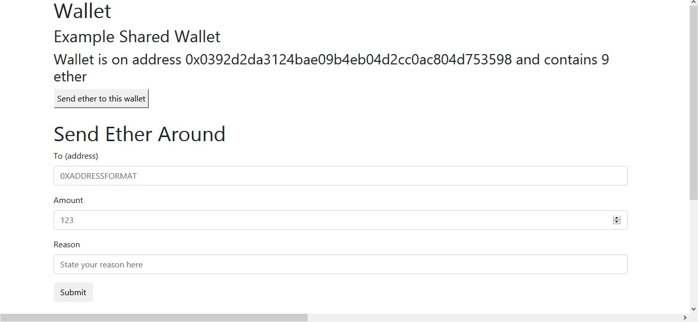
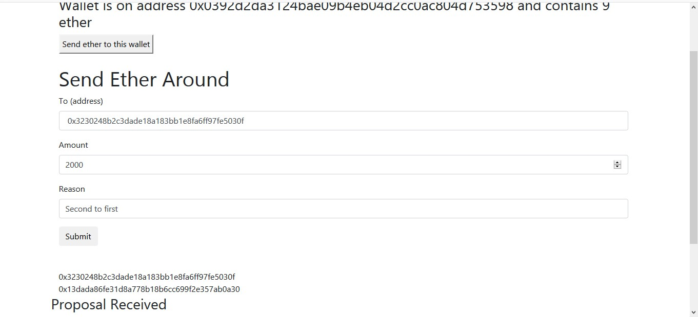
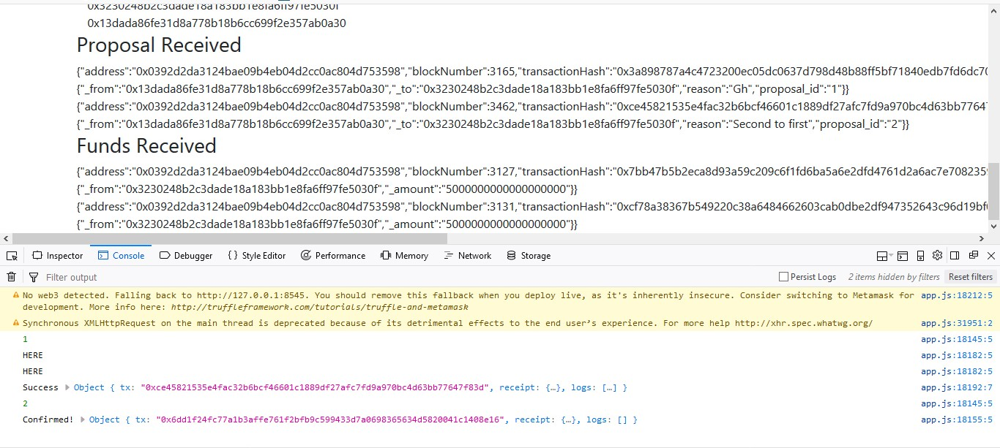

# Shared Wallet #
## My Mini Project in which I learnt creating a truffle project with webpack and: ##
###
* Writing decent contracts in Solidity
* Testing Events and filtering them
* Checking transaction logs and errors for debugging
* Working with some node modules for a better app
* Deploying the dapp in testrpc and Private network
* Using Mist to test
###

